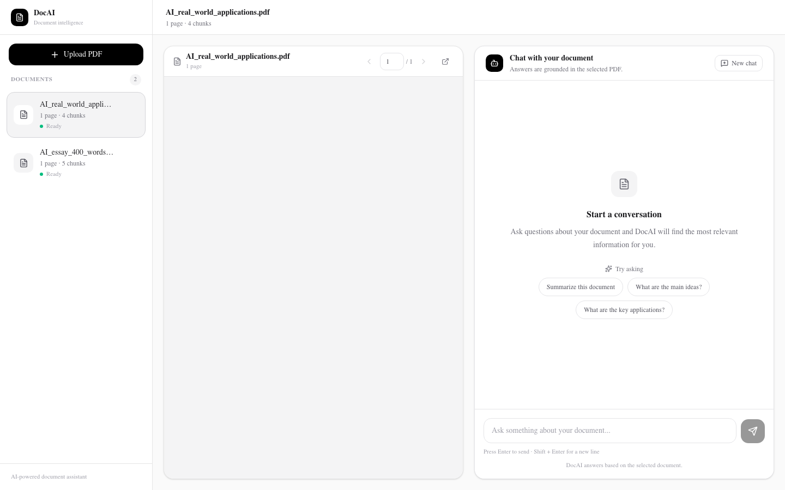
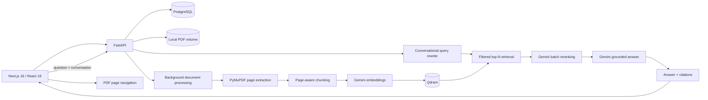

# DocAI

Full-stack Retrieval-Augmented Generation (RAG) application for asking grounded questions about PDF documents, inspecting cited passages, and navigating directly to the source page.

DocAI is a portfolio project focused on practical AI engineering: page-aware document processing, semantic retrieval, reranking, citations, evaluation, asynchronous ingestion, relational persistence, testing, and containerized deployment.



## What it does

- Upload or drag and drop PDF files up to 20 MB.
- Validate file extension, MIME type, PDF signature, size, filename safety, and duplicates.
- Process uploads asynchronously with visible `processing`, `ready`, and `failed` states.
- Extract and normalize text page by page with PyMuPDF.
- Build paragraph-aware chunks that never cross page boundaries.
- Generate Gemini embeddings and store vectors plus source metadata in Qdrant.
- Rewrite follow-up questions into standalone retrieval queries.
- Retrieve top-N candidates, batch-rerank them with Gemini, and send only the final top-K chunks to the answer model.
- Return answer sources with page, excerpt, vector score, rerank score, and final relevance.
- Open a cited source at its PDF page without changing the selected document.
- Create, switch, rename, and delete document conversations.
- Persist documents, conversations, and messages in PostgreSQL.
- Work in a responsive split view on desktop and document/chat panes on mobile.
- Evaluate retrieval and generation quality with a reproducible dataset.

## Architecture



Application data is deliberately separated by responsibility:

- PostgreSQL stores document metadata, conversations, and messages.
- Qdrant stores embeddings, chunk text, offsets, page ranges, and document filters.
- A persistent local volume stores original PDF files.

The relational model is:

```text
documents
  └── conversations
        └── messages
```

## RAG pipeline

1. The PDF is extracted page by page.
2. Text is normalized while preserving paragraph boundaries.
3. Each page is chunked independently, preferring paragraph, sentence, then word boundaries.
4. Every chunk retains `document_id`, `chunk_index`, global offsets, and page range.
5. Gemini creates a 3,072-dimensional embedding for each chunk.
6. Qdrant stores vectors and citation metadata.
7. A follow-up question is rewritten using persisted conversation history.
8. Qdrant retrieves top-N candidates filtered by `document_id`.
9. One Gemini request scores all candidates; vector and rerank scores are combined.
10. Candidates below the rerank threshold are removed and the top-K chunks form the LLM context.
11. The API returns the grounded answer and exactly the chunks used as sources.
12. Clicking a source opens the corresponding PDF page.

If reranking fails, DocAI falls back to Qdrant order so provider errors do not break the whole chat request.

## Tech stack

Frontend:

- Next.js 16
- React 19
- TypeScript
- Tailwind CSS 4
- React Markdown
- Axios
- Vitest and React Testing Library

Backend and AI:

- Python 3.13
- FastAPI and Pydantic
- SQLAlchemy 2
- PostgreSQL 17
- PyMuPDF
- Google Gemini generation and embedding APIs
- Qdrant vector database

Infrastructure:

- Docker and Docker Compose
- Multi-stage, non-root production containers
- GitHub Actions CI

The project does not use LangChain. The RAG orchestration is implemented directly so retrieval, reranking, context selection, and citation behavior remain explicit.

## Quick start with Docker

Requirements:

- Docker with Compose
- A Gemini API key

```bash
cp .env.example .env
```

Set `GEMINI_API_KEY` in `.env`, then run:

```bash
docker compose up --build
```

Open:

- Frontend: http://localhost:3000
- Backend API docs: http://localhost:8000/docs
- Qdrant dashboard: http://localhost:6333/dashboard

Stop services without deleting data:

```bash
docker compose down
```

To remove PostgreSQL, Qdrant, and uploaded-PDF volumes too:

```bash
docker compose down --volumes
```

## Local development

Start infrastructure:

```bash
docker compose up -d postgres qdrant
```

Backend:

```bash
cd backend
cp .env.example .env
# Set GEMINI_API_KEY in .env
python3.13 -m venv .venv
source .venv/bin/activate
pip install -r requirements.txt
uvicorn app.main:app --reload
```

Frontend, in another terminal:

```bash
cd frontend
cp .env.local.example .env.local
npm ci
npm run dev
```

## Environment variables

Required:

- `GEMINI_API_KEY`: Google AI Studio API key.

Service configuration:

- `DATABASE_URL`: SQLAlchemy PostgreSQL connection string.
- `QDRANT_HOST`, `QDRANT_PORT`, `QDRANT_COLLECTION_NAME`: vector database connection.
- `CORS_ORIGINS`: comma-separated allowed browser origins.
- `NEXT_PUBLIC_API_URL`: browser-visible FastAPI URL, baked into the frontend build.

Model configuration:

- `GEMINI_GENERATION_MODEL`
- `GEMINI_EMBEDDING_MODEL`
- `EMBEDDING_DIMENSION`

Retrieval configuration:

- `RAG_RETRIEVAL_TOP_N`
- `RAG_RETRIEVAL_SCORE_THRESHOLD`
- `RAG_RERANK_TOP_K`
- `RAG_RERANK_MIN_SCORE`
- `RAG_RERANK_VECTOR_WEIGHT`

See `.env.example`, `backend/.env.example`, and `frontend/.env.local.example`.

## API overview

Document endpoints:

- `POST /upload/` — validate a PDF, create a `processing` document, and schedule ingestion.
- `GET /upload/{filename}` — serve a stored PDF.
- `GET /documents/` — list documents and processing states.
- `DELETE /documents/{document_id}` — delete metadata, conversations, PDF, and vectors.

Conversation endpoints:

- `POST /documents/{document_id}/conversations`
- `GET /documents/{document_id}/conversations`
- `PATCH /conversations/{conversation_id}`
- `DELETE /conversations/{conversation_id}`
- `GET /conversations/{conversation_id}/messages`

Chat:

- `POST /chat` — answer against one document. `conversation_id` is optional for backward compatibility; when supplied, history is loaded from PostgreSQL and the exchange is persisted.

Interactive OpenAPI documentation is available at `/docs`.

## RAG evaluation

The evaluation suite contains:

- `evaluation/fixtures/ai_applications.txt` — deterministic three-page source content.
- `evaluation/questions.json` — five questions with expected keywords and source pages.
- `evaluation/run_evaluation.py` — fixture generation, upload, polling, evaluation, and cleanup.

Metrics:

- Retrieval Recall@K
- Mean Reciprocal Rank (MRR)
- Expected-keyword coverage
- Lexical groundedness proxy
- Gemini-judged answer relevance
- Gemini-judged faithfulness
- End-to-end latency

Run the complete evaluation:

```bash
backend/.venv/bin/python evaluation/run_evaluation.py
```

Use deterministic proxies only:

```bash
backend/.venv/bin/python evaluation/run_evaluation.py --skip-judge
```

For a quick smoke test:

```bash
backend/.venv/bin/python evaluation/run_evaluation.py \
  --skip-judge \
  --limit 1 \
  --request-delay 0
```

The default 30-second inter-question delay helps respect Gemini free-tier quotas. Reports are written to `evaluation/results/latest.json` and ignored by Git.

The verified one-question smoke run produced Recall@K `1.0`, MRR `1.0`, answer relevance proxy `1.0`, and faithfulness proxy `0.85`. A larger run should be used for meaningful model comparisons.

## Testing

Backend:

```bash
PYTHONPATH=backend:. backend/.venv/bin/python \
  -m unittest discover -s backend/tests -v
```

Frontend:

```bash
cd frontend
npm test
npm run lint
npm run build
npm audit --omit=dev
```

Current automated coverage includes:

- PDF normalization, chunk boundaries, overlap, offsets, and page metadata
- Qdrant payload metadata
- Retrieval context/source consistency
- Reranking, fallback behavior, and score combination
- Document and conversation persistence
- Async processing state transitions
- Upload API validation
- Evaluation metric calculations
- Document selection
- Chat interaction
- Source click to PDF page navigation
- Missing-page source behavior

CI runs backend tests, frontend tests, lint, production build, dependency audit, and Compose validation.

## Project structure

```text
doc-ai/
├── backend/
│   ├── app/
│   │   ├── api/routes/
│   │   ├── core/
│   │   ├── db/
│   │   ├── schemas/
│   │   └── services/
│   ├── tests/
│   └── Dockerfile
├── frontend/
│   ├── app/
│   ├── components/
│   ├── lib/
│   ├── types/
│   └── Dockerfile
├── evaluation/
├── docs/screenshots/
├── .github/workflows/ci.yml
└── docker-compose.yml
```

## Engineering trade-offs and next steps

The current design intentionally keeps an MVP boundary:

- FastAPI `BackgroundTasks` avoids queue infrastructure, but jobs do not survive backend restarts. A production multi-worker deployment should move ingestion to a durable queue.
- SQLAlchemy creates tables at startup. Alembic migrations should be added before evolving a deployed schema.
- PDFs use a local persistent volume. Object storage is the next step for multi-instance deployment.
- Authentication and per-user authorization are not implemented.
- The native browser PDF viewer provides stable page navigation, zoom, search, and download. Text-level source highlighting would require a dedicated PDF.js text layer and is not implemented.
- Reranking improves relevance but adds one Gemini request and is subject to provider latency and rate limits.

## Portfolio highlights

This project demonstrates:

- End-to-end RAG design without hiding retrieval logic behind a framework
- Metadata-safe PDF processing and verifiable source citations
- Dense retrieval plus configurable LLM reranking and graceful fallback
- Quantitative retrieval/generation evaluation
- FastAPI API design and asynchronous processing
- PostgreSQL relational modeling and Qdrant integration
- Responsive Next.js product UX
- Automated backend/frontend testing, CI, security auditing, and Docker deployment
